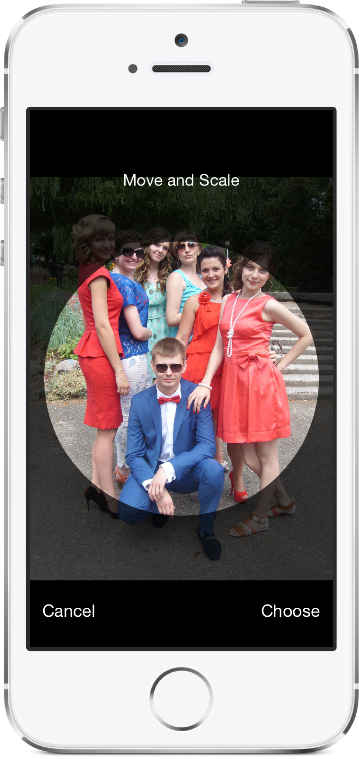

## RSKImageCropper [](https://travis-ci.org/ruslanskorb/RSKImageCropper) [](https://cocoapods.org/pods/RSKImageCropper) [](https://coveralls.io/r/ruslanskorb/RSKImageCropper) [](https://github.com/ruslanskorb/RSKImageCropper)

<p align="center">
	
</p>

An image cropper for iOS like in the Contacts app with support for landscape orientation.

## Installation
*RSKImageCropper requires iOS 6.0 or later.*

### Using [CocoaPods](http://cocoapods.org)

1.  Add the pod `RSKImageCropper` to your [Podfile](http://guides.cocoapods.org/using/the-podfile.html).

        pod 'RSKImageCropper'

2.  Run `pod install` from Terminal, then open your app's `.xcworkspace` file to launch Xcode.
3.  Import the `RSKImageCropper.h` header. Typically, this should be written as `#import <RSKImageCropper/RSKImageCropper.h>`

### Using [Carthage](https://github.com/Carthage/Carthage)

1.  Add the `ruslanskorb/RSKImageCropper` project to your [Cartfile](https://github.com/Carthage/Carthage/blob/master/Documentation/Artifacts.md#cartfile).

        github "ruslanskorb/RSKImageCropper"

2.  Run `carthage update`, then follow the [additional steps required](https://github.com/Carthage/Carthage#adding-frameworks-to-an-application) to add the iOS and/or Mac frameworks into your project.
3.  Import the RSKImageCropper framework/module.
    *  Using Modules: `@import RSKImageCropper`
    *  Without Modules: `#import <RSKImageCropper/RSKImageCropper.h>`

## Basic Usage

Import the class header.

``` objective-c
#import <RSKImageCropper/RSKImageCropper.h>
```

Just create a view controller for image cropping and set the delegate.

``` objective-c
- (IBAction)onButtonTouch:(UIButton *)sender
{
    UIImage *image = [UIImage imageNamed:@"image"];
    RSKImageCropViewController *imageCropVC = [[RSKImageCropViewController alloc] initWithImage:image];
    imageCropVC.delegate = self;
    [self.navigationController pushViewController:imageCropVC animated:YES];
}
```

## Delegate

`RSKImageCropViewControllerDelegate` provides three delegate methods. To use them, implement the delegate in your view controller.

```objective-c
@interface ViewController () <RSKImageCropViewControllerDelegate>
```

Then implement the delegate functions.

```objective-c
// Crop image has been canceled.
- (void)imageCropViewControllerDidCancelCrop:(RSKImageCropViewController *)controller
{
    [self.navigationController popViewControllerAnimated:YES];
}

// The original image has been cropped. Additionally provides a rotation angle used to produce image.
- (void)imageCropViewController:(RSKImageCropViewController *)controller
                   didCropImage:(UIImage *)croppedImage
                  usingCropRect:(CGRect)cropRect
                  rotationAngle:(CGFloat)rotationAngle
{
    self.imageView.image = croppedImage;
    [self.navigationController popViewControllerAnimated:YES];
}

// The original image will be cropped.
- (void)imageCropViewController:(RSKImageCropViewController *)controller
                  willCropImage:(UIImage *)originalImage
{
    // Use when `applyMaskToCroppedImage` set to YES.
    [SVProgressHUD show];
}
```

## DataSource

`RSKImageCropViewControllerDataSource` provides three data source methods. The method `imageCropViewControllerCustomMaskRect:` asks the data source a custom rect for the mask. The method `imageCropViewControllerCustomMaskPath:` asks the data source a custom path for the mask. The method `imageCropViewControllerCustomMovementRect:` asks the data source a custom rect in which the image can be moved. To use them, implement the data source in your view controller.

```objective-c
@interface ViewController () <RSKImageCropViewControllerDataSource>
```

Then implement the data source functions.

```objective-c
// Returns a custom rect for the mask.
- (CGRect)imageCropViewControllerCustomMaskRect:(RSKImageCropViewController *)controller
{
    CGSize maskSize;
    if ([controller isPortraitInterfaceOrientation]) {
        maskSize = CGSizeMake(250, 250);
    } else {
        maskSize = CGSizeMake(220, 220);
    }
    
    CGFloat viewWidth = CGRectGetWidth(controller.view.frame);
    CGFloat viewHeight = CGRectGetHeight(controller.view.frame);
    
    CGRect maskRect = CGRectMake((viewWidth - maskSize.width) * 0.5f,
                                 (viewHeight - maskSize.height) * 0.5f,
                                 maskSize.width,
                                 maskSize.height);
    
    return maskRect;
}

// Returns a custom path for the mask.
- (UIBezierPath *)imageCropViewControllerCustomMaskPath:(RSKImageCropViewController *)controller
{
    CGRect rect = controller.maskRect;
    CGPoint point1 = CGPointMake(CGRectGetMinX(rect), CGRectGetMaxY(rect));
    CGPoint point2 = CGPointMake(CGRectGetMaxX(rect), CGRectGetMaxY(rect));
    CGPoint point3 = CGPointMake(CGRectGetMidX(rect), CGRectGetMinY(rect));
    
    UIBezierPath *triangle = [UIBezierPath bezierPath];
    [triangle moveToPoint:point1];
    [triangle addLineToPoint:point2];
    [triangle addLineToPoint:point3];
    [triangle closePath];
    
    return triangle;
}

// Returns a custom rect in which the image can be moved.
- (CGRect)imageCropViewControllerCustomMovementRect:(RSKImageCropViewController *)controller
{
    // If the image is not rotated, then the movement rect coincides with the mask rect,
    // otherwise it is calculated individually for each custom mask.
    return controller.maskRect;
}
```

## Coming Soon

- If you would like to request a new feature, feel free to raise as an issue.

## Demo

Build and run the `RSKImageCropperExample` project in Xcode to see `RSKImageCropper` in action.
Have fun. Fork and send pull requests. Figure out hooks for customization.

## Contact

Ruslan Skorb

- http://github.com/ruslanskorb
- http://twitter.com/ruslanskorb
- ruslan.skorb@gmail.com

## License

This project is is available under the MIT license. See the LICENSE file for more info. Attribution by linking to the [project page](https://github.com/ruslanskorb/RSKImageCropper) is appreciated.
